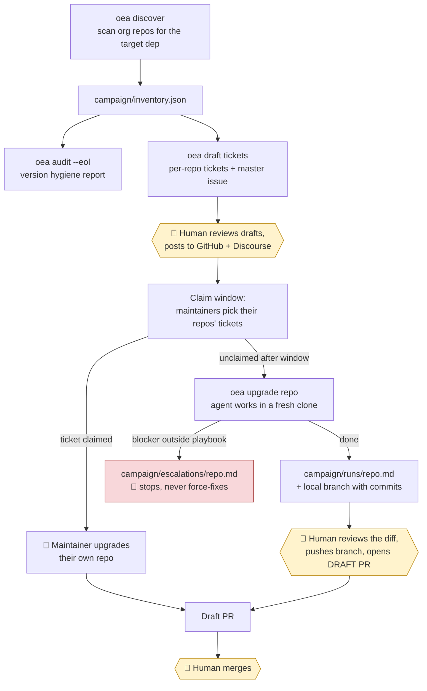
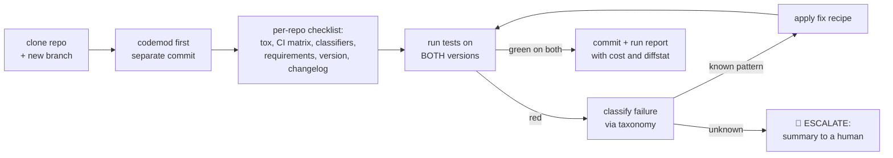

# openedx-ai-agent

AI-assisted **upgrade campaigns** for the Open edX ecosystem — Django, Python, Celery, and
other foundational dependencies that must be upgraded across hundreds of repos on a
recurring cycle.

## Why

Every ~2 years a new Django LTS lands; Python versions EOL on schedule; Celery and friends
move underneath everything. Each cycle, the same fleet-wide campaign runs across the
openedx org: discovery, ticketing, community mobilization, per-repo upgrade PRs, CI
triage, a dual-compatibility bridge, and a final platform flip. The process is proven —
it's been run by hand through the Django 4.2 (2023), Python 3.11/3.12 (2024), and Django
5.2 (2025) campaigns. This project codifies that process and builds AI agents to execute
the repetitive parts, so coordinators and maintainers spend their time on judgment, not
mechanics.

## How it's organized

| Doc | What it is |
|---|---|
| [`docs/campaign-process.md`](docs/campaign-process.md) | The **target-agnostic process**: discovery → launch/ticketing → small-to-big waves → dual-compat bridge → drop & done. Includes the per-repo checklist, failure taxonomy, upstream-contribution ladder, and definition of done. |
| [`docs/playbooks/django.md`](docs/playbooks/django.md) | Django-specific knowledge: release calendar, breaking-change pattern table (each entry backed by a real campaign PR), `django-upgrade` tooling, watchlist. |

**The agent is target-agnostic.** `oea discover --target <dep>` and
`oea upgrade <repo> --target <dep>` work for any upgradeable dependency — Python, Celery,
DRF, whatever moves next. The generic process alone is enough to run a campaign; a
`docs/playbooks/<target>.md` file is an optional knowledge pack (pattern table, codemod,
calendar, watchlist) added when a real campaign for that target kicks off, the way
`django.md` was distilled from the 4.2/5.2 campaigns.

## How a campaign flows



Yellow nodes are the **human gates** — every outward-facing or irreversible action passes
through one. The agent never posts, never pushes, never merges.

### Inside `oea upgrade` (the Dev worker)



The session's system prompt is the playbook itself (`campaign-process.md` + the target's
knowledge pack) — the agent executes the documented process, it doesn't improvise one.

## The agent model

Four agents map onto the process (PM → Dev → Reviewer → Fixer), with hard invariants:

- **Community first.** The agent is the *maintainer-at-large of last resort*: per-repo
  tickets get a claim window for human maintainers; the agent takes only what's left
  unclaimed or where a maintainer asks for help.
- **Human-gated outward actions.** Announcements, tickets, upstream issues and PRs are
  drafted by agents, reviewed and posted by humans.
- **Draft PRs only; humans merge.**
- **Escalation is success, not failure.** Anything outside the playbook stops and reports.

## Usage

```bash
git clone https://github.com/awais786/openedx-ai-agent.git && cd openedx-ai-agent
uv venv && uv pip install -e ".[dev]"        # or: pip install -e ".[dev]"

export GITHUB_TOKEN=ghp_...                  # discovery/audit (read-only API access)
export ANTHROPIC_API_KEY=sk-ant-...          # oea upgrade (the agent session)
```

The campaign flow, as CLI commands:

```bash
oea discover --target django                 # scan the org → campaign/inventory.json
oea audit --eol                              # who's on end-of-life versions?
oea draft tickets --new-version 6.2 --old-version 5.2
                                             # tickets + master issue → campaign/drafts/
                                             # (YOU review and post them)
oea upgrade <repo> --new-version 6.2 --old-version 5.2
                                             # agent upgrades a fresh clone, local-only
                                             # (YOU review the branch, push, open draft PR)
```

Safety note for first runs: point at a **fork** (`oea --org <your-user> upgrade <repo> …`),
never upstream, until you trust the output.

## Status

Working MVP. The playbooks encode the judgment from the hand-run campaigns and double as
the agents' instructions — `oea upgrade` literally uses them as its system prompt. Being
validated on small, low-blast-radius repos first (the same way the human campaigns build
confidence).

## Provenance

Distilled from campaigns coordinated by [@awais786](https://github.com/awais786) and the
Open edX community: master issue
[openedx/public-engineering#339](https://github.com/openedx/public-engineering/issues/339),
breaking-change tickets #340/#341, the
[Django 5.2 coordination thread](https://discuss.openedx.org/t/django-5-2-upgrade-plan/15397),
and the merged PR history across the openedx org.
